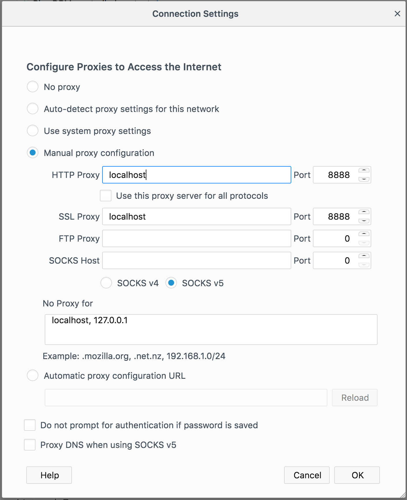

# Nginx forward proxy

[Nginx](https://nginx.org/en/) is a very fast HTTP and reverse proxy server. 
Usually, Nginx is used to serve and cache static assets or as proxy or load balancer for incoming traffic to application servers. In this repository, it is used as forward proxy. 

## Use Case

Assume you have a network where you want to control outgoing traffic. 
You either want to: 

 - Deny all outgoing calls by default and only allow HTTP(S) calls to allowlisted URLs.
 - Allow all outgoing calls by default and only block HTTP(S) calls to denylisted URLs.

The Docker daemon can be configured that way that it routes all traffic through an proxy. This proxy can be an Nginx which is configured as forwarding proxying.

## ngx\_http\_proxy\_connect\_module

Nginx can be configured for forwarding proxying. 
Unfortunately, that doesn't work very well with HTTPS connections. 
As soon the user is calling a URL via https, Nginx will throw errors. 
There is a [StackOverflow issue](https://superuser.com/questions/604352/nginx-as-forward-proxy-for-https)
to that topic. Luckily there is a solution for that problem. 
The [ngx\_http\_proxy\_connect\_module](https://github.com/chobits/ngx_http_proxy_connect_module)
is solving this issue. If Nginx is compiled with that module, 
the proxying will work with SSL connections as well. 

## Docker Build

The Dockerfile in this repository is assembling an Nginx with the [ngx\_http\_proxy\_connect\_module](https://github.com/chobits/ngx_http_proxy_connect_module)
and an nginx.conf file which blocks all outgoing traffic by default, 
but allows access to some allowlisted domains like google.com.
The Docker image can be built like this: 

```
docker build -t reiz/nginx_proxy:0.0.3 . 
```

Or simply download it from [Docker Hub](https://hub.docker.com/r/reiz/nginx_proxy/) with: 

```
docker pull reiz/nginx_proxy:0.0.3
```

## Allowlist certain domains

This repository contains two nginx configuration files. 
The `nginx_allowlist.conf` file is built for the use case that you want to deny all outgoing traffic by default and only allow some allowlisted domains. 
In the first server section domains can be allowlisted by simply adding a 
`server_name *` line for each allowlisted domain. Here an example: 

```
    # Allowlist Google
    server {
        listen       8888;
        server_name  google.com;
        server_name  *.google.com;
        server_name  google.de;
        server_name  www.google.de;
        proxy_connect;
        proxy_max_temp_file_size 0;
        resolver 8.8.8.8;
        location / {
           proxy_pass http://$http_host;
           proxy_set_header Host $http_host;
        }
    }
```

Regex can be used to describe a domain. This `*.google.com` for example is allowlisting all subdomains of google.com. In the above example, google.com and all subdomains of it are allowlisted. Beside that google.de and www.google.de are allowlisted. Subdomains of google.de are **not** allowlisted. 
The proxy would allow outgoing calls to this domains: 

 - google.com
 - www.google.com
 - mail.google.com
 - api.google.com
 - google.de
 - www.google.de
 
This domains are blocked with the above configuration: 
 
 - mail.google.de
 - api.google.de

By starting the Docker container the file can be mounted into the running container. 

```
docker run -d -p 8888:8888 -v ${PWD}/nginx_allowlist.conf:/usr/local/nginx/conf/nginx.conf reiz/nginx_proxy:0.0.3 
```

Now the Docker container is running with the mounted configuration.

## Denylist certain domains

This repository contains two nginx configuration files. 
The `nginx_denylist.conf` file is built for the use case that you want to allow all outgoing traffic by default and only block traffic to some domains. 
In the first server section domains can be denylisted by simply adding a 
`server_name *` line for each denylisted domain. Here an example: 

```
    server {
        listen       8888;
        server_name  google.com;
        server_name  *.google.com;
        return 404;
    }
```

In the example above all pages would be accessible, but google.com and all subdomains of it would be blocked. Regex can be used here in the same way as in the allowlist example. 
By starting the Docker container the file can be mounted into the running container. 

```
docker run -d -p 8888:8888 -v ${PWD}/nginx_denylist.conf:/usr/local/nginx/conf/nginx.conf reiz/nginx_proxy:0.0.3
```

Now the Docker container is running with the mounted configuration.

## Testing

You can test your configuration by pointing your Browser to the Nginx proxy in the running Docker container. 
If you run the Docker container on your localhost, then you can point your Browser to `localhost:8888`. 
Here is an example how it looks like in Firefox: 



## Configuring Docker and Kubernetes with a Proxy

Assuming you have a cluster of Docker machines (Kubernetes cluster)
and you would like to route all outgoing traffic to your proxy. 
That can be achieved by setting some global ENV variables on each Docker machine. 

For RedHat/CentOS version 6:

```shell
cat <<EOF | sudo tee -a /etc/sysconfig/docker
export http_proxy="http://myproxy.example.com:8888"
export https_proxy="https://myproxy.example.com:8888"
export no_proxy=<REGISTRY_IP>
EOF
 
sudo service docker restart
```

For RedHat/CentOS version 7, remove export:

```shell
cat <<EOF | sudo tee -a /etc/sysconfig/docker
http_proxy="http://myproxy.example.com:8888"
https_proxy="https://myproxy.example.com:8888"
no_proxy=<REGISTRY_IP>
EOF
 
sudo sed -i '/\[Service\]/a EnvironmentFile=/etc/sysconfig/docker' /usr/lib/systemd/system/docker.service
sudo systemctl daemon-reload
sudo service docker restart
```

For Ubuntu 14.04:

```shell
cat <<EOF | sudo tee -a /etc/default/docker
export http_proxy="http://myproxy.example.com:8888"
export https_proxy="https://myproxy.example.com:8888"
export no_proxy=<REGISTRY_IP>
EOF
 
sudo restart docker
```

For Kubernetes it works the same way. 
The `http_proxy` ENV has to be set before the K8S processes are starting.
Minikube can be started with proxy params directly.
Here an example: 

```shell
https_proxy=http://<PROXY_SERVER>:80 minikube start --docker-env HTTP_PROXY=http://<PROXY_SERVER>:80 --docker-env HTTPS_PROXY=http://<PROXY_SERVER>:80 --docker-env NO_PROXY=192.168.99.0/24
```

Alternatively the Proxy can be set by Container start as well: 

```shell
docker run -e "http_proxy=http://myproxy.example.com:8888" \
           -e "https_proxy=https://myproxy.example.com:8888" \
           -d liveperson\app run.sh
```

## Version Matrix

This tables show which Docker tag contains which Ubuntu & Nginx version: 

| Docker tag              | Ubuntu version | Nginx version | Published at | Comment         | 
|-------------------------|----------------|---------------|--------------|-----------------|
| reiz/nginx_proxy:0.0.1  | 16.04          | 1.10.3        |              |                 |
| reiz/nginx_proxy:0.0.2  | 18.04          | 1.14.0        |              |                 |
| reiz/nginx_proxy:0.0.3  | 20.04          | 1.18.0        |              |                 |
| reiz/nginx_proxy:0.0.4  | 20.04          | 1.18.0        | 2021-04-25   | With libssl-dev |
| reiz/nginx_proxy:0.0.5  | 20.04          | 1.18.0        | 2021-09-17   | Reduced image size from 471MB to 147MB |


## License 

This repository is open source under the MIT license. The full license text is available in the LICENSE.md file.
